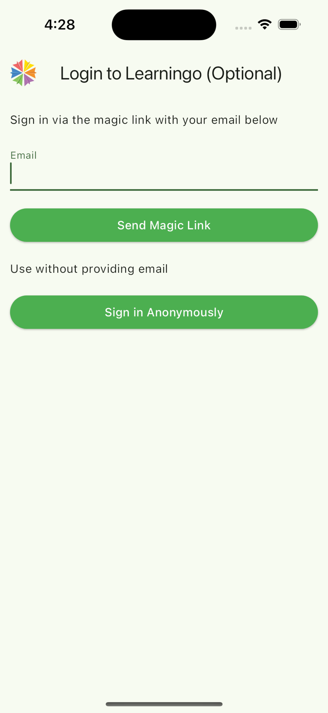
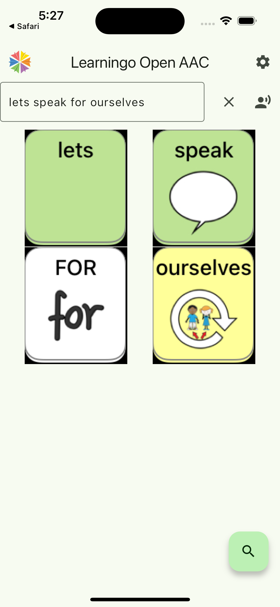
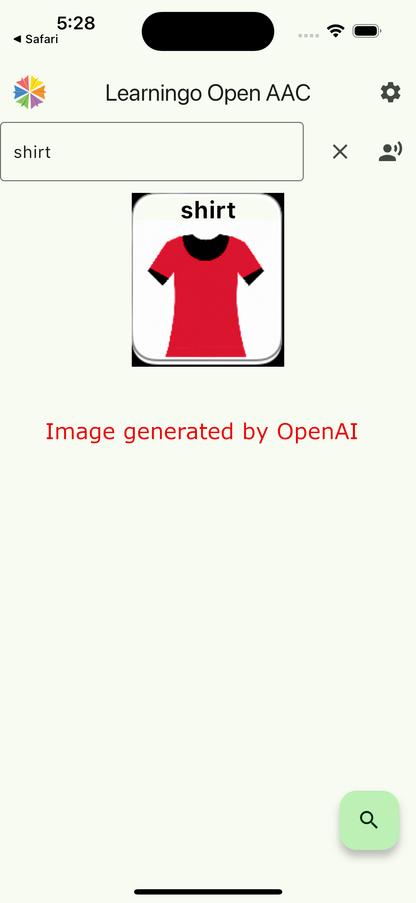

# Open Augmentative and Alternative Communication App

AI can be used to help people communicate!

This project uses [OpenAI Vector embeddings](https://platform.openai.com/docs/guides/embeddings) to translate a user's text/speech into easy to understand [AAC](https://www.asha.org/public/speech/disorders/aac/) symbols. The OpenAAC app uses OpenAI to match symbols to text to convert natural language to AAC pictograms.

Currently in trial at [Learningo](https://learningo.org/)!

**Highlights** 
 * If there isn't a high match from the Vector DB, OpenAAC will use [OpenAI DALL-E 3](https://openai.com/dall-e-3) to generate a symbol's image. This image data is cached in local storage.
 * Tap on icon to hear the associated word using Text-To-Speech engine.
   * Tap on "speak" button to read out the entire text using the device's text to speech engine.

The goal is to assist in communication between neurotypical and nonneurotypical users via mobile devices.

# App Images
</img>
</img>
</img>
</img>

# Background
My name is [Ronan O'Driscoll](https://ronanodriscoll.com/). I am a software developer with an autistic son. Through therapy and assisted communication tools, his ability to communicate has improved considerably from when he was largely non-verbal. 

However, it is often a struggle to pass back and forth his iPad to communicate via his AAC app. So I thought I would create a universal mobile app for a secondary user to input his symbols. We use the Speak4Yourself app, but it is only available on iOS. I wanted to create an open source alternative which could be used on any mobile device.

The OpenAAC App can work with any AAC symbol set, but you need to generate and upload them manually. The `db/` folder in this repo has a number of tools to prepare and upload and convert your images as vector embeddings to the Pinecone online vector database.

The `app/open_aac` folder contains the Flutter app uses cloud services to match text to symbols.

AI is a powerful tool. I hope this project can help people communicate better.

## AAC Symbol Sets 
 * [Open Symbols library](https://www.opensymbols.org/)
 * [The Noun Project](https://thenounproject.com/)
 * [Speak4Yourself](https://speakforyourself.org/)
   * Free download of the Speak4Yourself AAC symbols here: https://smartysymbols.com/download/free-speak-for-yourself-printable/

## Architecture
The alpha version of the flutter app connected directly to OpenAI and a Pinecone database. Unfortunately, this approach does not scale to a pool of larger users. The diagram below illustrates how the beta app connects to a vector-enabled Postgres database hosted on [Supabase](https://supabase.com/). Supabase is an exciting platform with a lot of benefits for this project, including serverless Edge functions for connecting to a vector-enabled [Postgres](https://www.postgresql.org/) database and OpenAI image generation. Supabase also provides a robust authentication mechanism, along with S3 storage of icon images. The following illustrates the flow when a user enters their text, to retrieval and presentation of the OpenAAC images.

Beginning with the Flutter client app, the details of the flow are as follows:

 1. The User authenticates with the Supabase Auth service.
 1. An authenticated user calls an Edge function to return Images for each word.
 1. The Edge function converts each word to an embedding using the OpenAI embedding service.
 1. The Edge function takes the embedding vector and call a Postgres function.
 1. This function runs a cosine similiarity match against the Images table.
    * A separate edge function calls [OpenAI DALL-E 3](https://openai.com/dall-e-3) generation when there isn't a good match for the word.
 1. The app will call Supabase Storage for the images which can be cached locally

## Technology Stack
 * [Flutter](https://flutter.dev/): Cross platform mobile app framework
 * [Supabase](https://supabase.com/): Cloud provider of Postgres database and Serverless Edge functions
 * [Upstash Redis](https://upstash.com/): Cloud provider of Redis cache 
 * [Postgres](https://www.postgresql.org/): Open source database (with [pgvector](https://github.com/pgvector/pgvector/) support)
 * [Pinecone](https://pub.dev/packages/pinecone): Pinecone vector database (deprecated)
 * [Langchain](https://pub.dev/packages/langchain): LangChain provides a set of ready-to-use components for working with language models and the concept of chains, which allows to "chain" components together to formulate more advanced use cases around LLMs.
 * [OpenAI Embeddings](https://platform.openai.com/docs/guides/embeddings): OpenAI’s text embeddings measure the relatedness of text strings
 * [OpenAI DALL-E 3](https://openai.com/dall-e-3)

 ## Installation
 Details on app availability (Android and iOS) and sign-up will be posted here soon.

 ## Installation (Deprecated)
  1. Install Flutter: https://flutter.dev/docs/get-started/install
  2. Create a Pinecone account: https://www.pinecone.io/. You can use the free tier for this project.
  3. Create an OpenAI API account: https://platform.openai.com/. We will use the "text-embedding-ada-002" model which is priced very cheaply ($0.0001/1K tokens as of January 2024). See [this page](https://openai.com/pricing#language-models) for more details. For image generation, we will use "dall-e-3", which is free of charge (as of January 2024).
  4. Clone this repo
  5. Follow instructions in the `db/` folder to create a Pinecone database and upload your AAC symbols.
  6. Copy the generated icons to the `app/open_aac/assets/images` folder.
  7. Use `flutter` in the `app/open_aac` folder to run the app locally.
  8. Install on your android device by connecting it to the computer using `flutter install`. See [this page](https://docs.flutter.dev/deployment/android#install-an-apk-on-a-device) for more details.

## Usage
  1. Open the app
  2. Click on the settings icon in the top right corner.[Deprecated]
  3. Enter your OpenAI and Pinecone API keys, along with Pinecone Project ID and Environment. [Deprecated]
  4. Hit Save [Deprecated]
  5. Return to the main screen
  6. Enter a sentence in the text box
  7. Press the search button
  8. The app will return a list of symbols matching the text
  9. The Clear button next to the text box will clear the text and symbols

## Future Goals
 * ~~A local cache of words to images to cut down on API calls~~
 * ~~Use a Large Language Model (Dalle-3) to generate symbols when there are low confidence matches in the vector DB.~~
 * ~~Full Supabase integration~~
 * [Autocomplete of previously entered sentences](https://www.dhiwise.com/post/flutter-textfield-autocomplete-for-efficient-user-data-entry)
 * Use Supabase Edge Function AI to generate embeddings. See [here](https://supabase.com/docs/guides/ai/quickstarts/generate-text-embeddings)
 * Make freely available on the Google Play Store and ~~Apple App Store~~
 * Better integration with other AAC symbol sets
 * Allow users to upload their own custom symbols
 * Offline mode, so that the app can be used without an internet connection and/or database. Requires local vector database.
 * ~~Text to speech option: tap on icons to hear the word.~~ 
   * ~~A button to read out the text using the device's text to speech engine.~~ This would also highlight the symbols as they are spoken.
